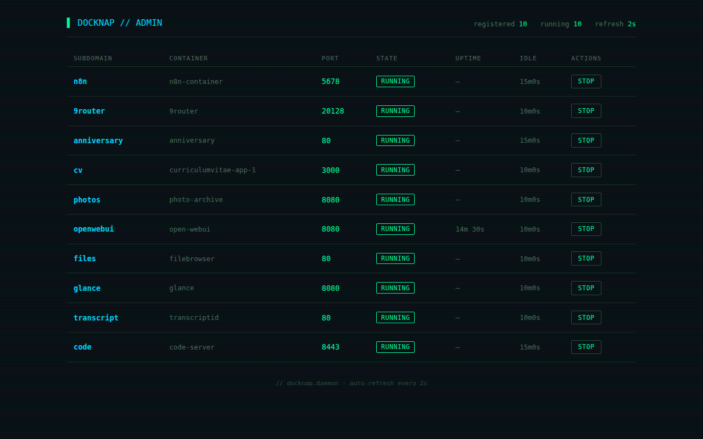
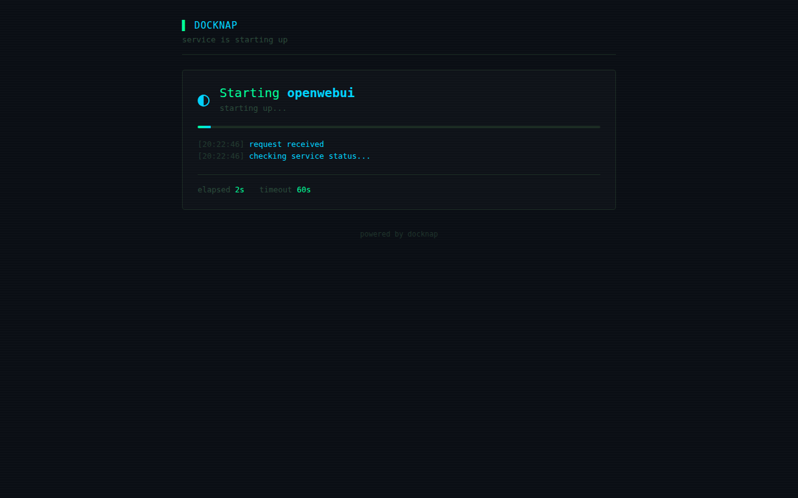

# docknap

**A lazy-loading reverse proxy for Docker containers.** Put it in front of your rarely-used services and they stay off until someone actually requests them.

[](https://github.com/ekmalrey/docknap/actions)
[](https://github.com/ekmalrey/docknap/releases)
[](LICENSE)
[](https://github.com/ekmalrey/docknap/pkgs/container/docknap)

**Admin UI** &mdash; live status, wake, stop


**Loading page** &mdash; shown while a container boots


## How it works

- docknap sits in front of your "sleepable" containers
- Containers opt in via Docker labels
- On request, docknap checks if the container is running, starts it if not, waits for the port, then proxies
- After a configurable idle timeout, docknap stops the container
- While the container boots, docknap serves a customizable loading page that polls until the service is ready
- An admin UI lets you see status, wake, and stop services
- Prometheus metrics are exposed for scraping
- Optional HTTP Basic Auth protects admin endpoints

## Quick start

```bash
# 1. Create the network (once)
docker network create docknap_network

# 2. Run docknap
docker run -d --name docknap \
  -p 8000:8000 \
  -v /var/run/docker.sock:/var/run/docker.sock \
  --network docknap_network \
  ghcr.io/ekmalrey/docknap:latest
```

Add labels to any container you want to be lazy-loaded, attach it to `docknap_network`, and start it. Now hitting `http://<container-ip>:port` (via a reverse proxy) will trigger a start.

## Container labels

| Label | Required | Default | Description |
|-------|----------|---------|-------------|
| `docknap.enable` | yes | — | Must be `true` |
| `docknap.subdomain` | yes | — | Subdomain to route on (e.g. `myapp` for `myapp.internal`) |
| `docknap.target_port` | yes | — | Port inside the container to proxy to |
| `docknap.idle_timeout` | no | `5m` | How long to wait before stopping the container after the last request |
| `docknap.startup_timeout` | no | `60s` | Max time to wait for the container to become ready |
| `docknap.title` | no | subdomain | Display name on the loading page |
| `docknap.subtitle` | no | `service is starting up` | Subtitle on the loading page |
| `docknap.icon` | no | `◐` | Icon shown next to the title |
| `docknap.theme` | no | `green` | Color theme: `green`, `blue`, `amber`, `red`, `purple` |
| `docknap.show_logs` | no | `true` | Show live boot log on the loading page |
| `docknap.show_stats` | no | `true` | Show elapsed time and timeout footer |

## Environment variables

| Var | Default | Description |
|-----|---------|-------------|
| `DOCKNAP_LISTEN` | `:8000` | Address to listen on |
| `DOCKNAP_IDLE_DEFAULT` | `5m` | Default idle timeout |
| `DOCKNAP_START_TIMEOUT` | `60s` | Default startup timeout (overridden by `docknap.startup_timeout` label) |
| `DOCKNAP_NETWORK` | `docknap_network` | Docker network used to resolve container IPs |
| `DOCKNAP_LOG_FORMAT` | `text` | `text` or `json` |
| `DOCKNAP_ADMIN_HOST` | (unset) | If set, the admin UI is served at the root of this hostname (e.g. `https://docknap.internal/`). Other hostnames are unaffected. |
| `DOCKNAP_ADMIN_USER` | (unset) | If set with `DOCKNAP_ADMIN_PASS`, requires HTTP Basic Auth for all `/_docknap/*` endpoints except `/_docknap/wait/` (used by the loading page) |
| `DOCKNAP_ADMIN_PASS` | (unset) | Password for admin auth (must be set with `DOCKNAP_ADMIN_USER`) |

## Network setup

docknap needs to reach the managed containers. They must share a Docker network. Create an external network and attach all docknap-managed containers to it:

```bash
docker network create docknap_network
```

Then in each managed container's compose file:

```yaml
services:
  myapp:
    labels:
      - "docknap.enable=true"
      - "docknap.subdomain=myapp"
      - "docknap.target_port=8080"
      - "docknap.idle_timeout=15m"
      - "docknap.startup_timeout=90s"
      - "docknap.title=My App"
      - "docknap.subtitle=private service"
      - "docknap.icon=⚡"
      - "docknap.theme=blue"
      - "docknap.show_logs=true"
      - "docknap.show_stats=true"
    networks:
      - docknap_network

networks:
  docknap_network:
    external: true
```

docknap itself also joins the `docknap_network` network and mounts the Docker socket:

```yaml
services:
  docknap:
    image: ghcr.io/ekmalrey/docknap:latest
    volumes:
      - /var/run/docker.sock:/var/run/docker.sock
    environment:
      - DOCKNAP_NETWORK=docknap_network
    networks:
      - docknap_network

networks:
  docknap_network:
    external: true
```

docknap needs read+write access to the Docker socket (it starts and stops containers).

## Routing

Point a reverse proxy (e.g. Caddy) at docknap, preserving the `Host` header:

```caddy
docknap.internal *.internal {
    tls internal

    @adguard host adguard.internal
    handle @adguard {
        reverse_proxy host.docker.internal:3080
    }

    handle {
        reverse_proxy docknap:8000 {
            header_up Host {host}
        }
    }
}
```

docknap reads the subdomain from `Host: myapp.internal` and looks up `myapp` in its registry.

If `DOCKNAP_ADMIN_HOST=docknap.internal` is set, the same host also serves the admin UI at the root (`https://docknap.internal/`) — so you can bookmark it as the dashboard entry point. Add the host to your Caddy site block to cover it with the same wildcard cert.

## Loading page

While a container is booting, docknap serves a self-contained HTML page that:

- Polls `/_docknap/wait/<subdomain>` every second (no full-page refresh)
- Shows a progress bar, elapsed time, and a stylized boot sequence
- Auto-reloads once the service is ready
- Shows a "startup timed out" panel with a Retry button if the timeout is hit

The boot log is a fixed set of staged messages (purely cosmetic), not a live tail of the container's stdout. The page does not expose container names, ports, hostnames, or any internal state.

## Endpoints

| Endpoint | Description |
|----------|-------------|
| `GET /` | Proxy (used by reverse proxy) |
| `GET /_docknap`, `GET /_docknap/`, `GET /_docknap/ui` | Admin UI (HTML) |
| `GET /_docknap/status` | JSON list of registered services and their state |
| `GET /_docknap/wake/<subdomain>` | Manually wake a service without proxying |
| `POST /_docknap/stop/<subdomain>` | Manually stop a service |
| `GET /_docknap/wait/<subdomain>` | JSON readiness probe used by the loading page (`{"ready","timed_out","elapsed"}`) |
| `GET /_docknap/metrics` | Prometheus metrics for all services (text format) |
| `GET /_docknap/metrics/<subdomain>` | Prometheus metrics filtered to one service |
| `GET /_docknap/history/<subdomain>` | JSON with current state, event counts, and last 100 events |

If `DOCKNAP_ADMIN_HOST` is set, the admin UI is also served at the root of that host (e.g. `https://docknap.internal/`). On other hostnames, the root path is the normal proxy.

The admin UI shows a live table of all registered services with state, uptime, and Wake/Stop buttons. It auto-refreshes every 2 seconds.

## Per-service history

`GET /_docknap/history/<subdomain>` returns a JSON object with:

- `subdomain`, `container`, `target_port`, `state`
- `docknap_tracks_started_at` and `uptime_s` (when docknap itself started the container)
- `docker_started_at` (from Docker's state)
- `event_counts` — counters by event type
- `events` — ring buffer of the last 100 events

Event types: `start_requested`, `ready`, `idle_stop`, `stopped` (with `reason: manual|idle`), `start_error`, `startup_timeout`, `disappeared`. Each event has a timestamp, type, message, and optional structured fields.

## Admin auth

The admin UI and management endpoints can be locked down with HTTP Basic Auth. Set both env vars:

```yaml
environment:
  - DOCKNAP_ADMIN_USER=admin
  - DOCKNAP_ADMIN_PASS=your-secret-here
```

When enabled, all `/_docknap/*` endpoints require auth **except `/_docknap/wait/`** (the loading page polls it from the browser). Browsers will prompt for credentials. Failed attempts increment `docknap_admin_auth_failures_total`.

Passwords are stored as SHA-256 hashes in memory and compared with constant-time equality.

> **Security:** HTTP Basic Auth sends credentials base64-encoded, not encrypted. **Always run docknap behind a TLS-terminating reverse proxy.** docknap will log a warning at startup if no admin credentials are configured.

## Security

docknap has full read+write access to the Docker socket (it starts and stops containers). Anyone who can reach the docknap port effectively has root-equivalent control over the Docker host. Treat the port as equivalent to shell access.

Recommendations:

- Always run docknap behind a TLS-terminating reverse proxy (Caddy, nginx, Traefik).
- Set `DOCKNAP_ADMIN_USER` and `DOCKNAP_ADMIN_PASS` if the port is exposed beyond localhost. docknap will emit a warning at startup if these are unset.
- Bind docknap's port to a trusted network only (e.g. a private Docker network, not `0.0.0.0` on a public host).
- Use a dedicated, low-privilege user account for the Docker socket where the engine supports it.
- Rotate `DOCKNAP_ADMIN_PASS` periodically. Generate with `openssl rand -hex 24`.

## Logging

docknap logs structured events with a level, message, and key/value fields.

Text format (default):

```
2026-06-01T12:00:00.000Z [info] container ready {subdomain=openwebui, container=open-webui, elapsed_ms=10500}
```

JSON format (set `DOCKNAP_LOG_FORMAT=json`):

```json
{"level":"info","subdomain":"openwebui","container":"open-webui","elapsed_ms":10500,"msg":"container ready","ts":"2026-06-01T12:00:00.000Z"}
```

Events include: container start/stop, idle timeouts, startup timeouts, proxy errors, watch events, registration.

## Metrics

docknap exposes Prometheus metrics at `/_docknap/metrics`:

| Metric | Type | Labels | Description |
|--------|------|--------|-------------|
| `docknap_proxy_requests_total` | counter | `subdomain`, `status` | Proxied requests by HTTP status |
| `docknap_proxy_duration_seconds` | histogram | `subdomain` | Request duration through docknap |
| `docknap_container_starts_total` | counter | `subdomain` | Container starts triggered by docknap |
| `docknap_container_stops_total` | counter | `subdomain`, `reason` | Container stops |
| `docknap_idle_timeouts_total` | counter | `subdomain` | Idle timeouts that stopped a container |
| `docknap_startup_failures_total` | counter | `subdomain`, `reason` | Startup failures (`startup_timeout`, `start_error`) |
| `docknap_start_duration_seconds` | histogram | `subdomain` | Time from wake to ready port |
| `docknap_container_state` | gauge | `subdomain`, `state` | Current container state (1 for active state) |
| `docknap_registered_containers` | gauge | — | Number of registered containers |
| `docknap_admin_auth_failures_total` | counter | `path`, `reason` | Admin auth failures (`missing`, `malformed`, `invalid`) |

## Install

### Docker (recommended)

```bash
docker pull ghcr.io/ekmalrey/docknap:latest
```

### From source

```bash
go install github.com/ekmalrey/docknap@latest
```

## Build & run locally

```bash
git clone https://github.com/ekmalrey/docknap
cd docknap
docker build -t docknap .
docker run -d --name docknap -p 8000:8000 \
  -v /var/run/docker.sock:/var/run/docker.sock \
  --network docknap_network docknap
```

## Examples

See [`examples/nginx/`](examples/nginx/) for a minimal demo.

## Screenshots

See the screenshots at the top of this README.

## License

MIT
